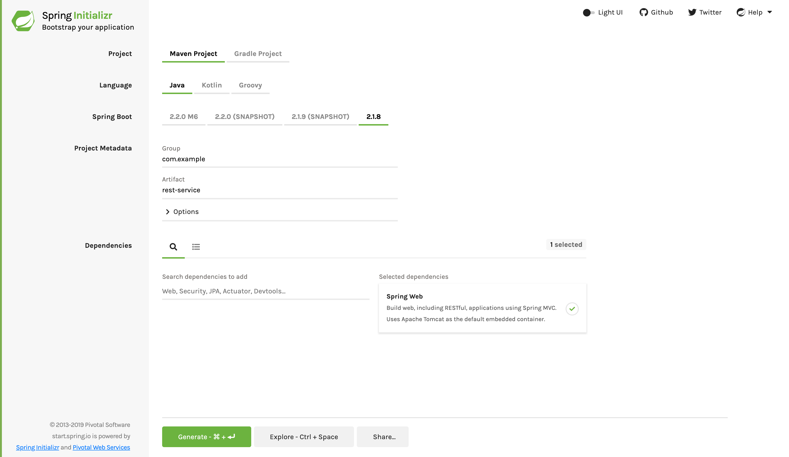

:spring_version: current
:toc:
:project_id: gs-rest-service
:spring_version: current
:spring_boot_version: 2.2.1.RELEASE
:icons: font
:source-highlighter: prettify

This guide walks you through the process of creating a "`Hello, World`" RESTful web
service with Spring.

== What You Will Build

You will build a service that will accept HTTP GET requests at
`http://localhost:8080/greeting`.

It will respond with a JSON representation of a greeting, as the following listing shows:

====
[source,json]
----
{"id":1,"content":"Hello, World!"}
----
====

You can customize the greeting with an optional `name` parameter in the query string, as
the following listing shows:

====
[source,text]
----
http://localhost:8080/greeting?name=User
----
====

The `name` parameter value overrides the default value of `World` and is reflected in the
response, as the following listing shows:

====
[source,json]
----
{"id":1,"content":"Hello, User!"}
----
====

== What You Need

:java_version: 1.8
include::https://raw.githubusercontent.com/spring-guides/getting-started-macros/master/prereq_editor_jdk_buildtools.adoc[]

include::https://raw.githubusercontent.com/spring-guides/getting-started-macros/master/how_to_complete_this_guide.adoc[]

[[scratch]]
== Starting with Spring Initializr

For all Spring applications, you should start with the https://start.spring.io[Spring
Initializr]. The Initializr offers a fast way to pull in all the dependencies you need for
an application and does a lot of the setup for you. This example needs only the Spring Web
dependency. The following image shows the Initializr set up for this sample project:

NOTE: The preceding image shows the Initializr with Maven chosen as the build tool. You
can also use Gradle. It also shows values of `com.example` and `rest-service` as the Group
and Artifact, respectively. You will use those values throughout the rest of this sample.

The following listing shows the `pom.xml` file that is created when you choose Maven:

====
[source,xml]
----
include::initial/pom.xml[]
----
====

The following listing shows the `build.gradle` file that is created when you choose Gradle:

====
[source,text]
----
include::initial/build.gradle[]
----
====

[[initial]]
== Create a Resource Representation Class

Now that you have set up the project and build system, you can create your web service.

Begin the process by thinking about service interactions.

The service will handle `GET` requests for `/greeting`, optionally with a `name` parameter
in the query string. The `GET` request should return a `200 OK` response with JSON in the
body that represents a greeting. It should resemble the following output:

====
[source,json]
----
{
    "id": 1,
    "content": "Hello, World!"
}
----
====

The `id` field is a unique identifier for the greeting, and `content` is the textual
representation of the greeting.

To model the greeting representation, create a resource representation class. To do so,
provide a plain old Java object with fields, constructors, and accessors for the `id` and
`content` data, as the following listing (from
`src/main/java/com/example/restservice/Greeting.java`) shows:

[source,java]
----
include::complete/src/main/java/com/example/restservice/Greeting.java[]
----

====
NOTE: This application uses the https://github.com/FasterXML/jackson[Jackson JSON] library to
automatically marshal instances of type `Greeting` into JSON. Jackson is included by default by the web starter.
====

== Create a Resource Controller

In Spring's approach to building RESTful web services, HTTP requests are handled by a
controller. These components are identified by the
https://docs.spring.io/spring/docs/{spring_version}/javadoc-api/org/springframework/web/bind/annotation/RestController.html[`@RestController`]
annotation, and the `GreetingController` shown in the following listing (from
`src/main/java/com/example/restservice/GreetingController.java`) handles `GET` requests
for `/greeting` by returning a new instance of the `Greeting` class:

====
[source,java]
----
include::complete/src/main/java/com/example/restservice/GreetingController.java[]
----
====

This controller is concise and simple, but there is plenty going on under the hood. We
break it down step by step.

The `@GetMapping` annotation ensures that HTTP GET requests to `/greeting` are mapped to the `greeting()` method.

NOTE: There are companion annotations for other HTTP verbs (e.g. `@PostMapping` for POST). There is also a `@RequestMapping` annotation that they all derive from, and can serve as a synonym (e.g. `@RequestMapping(method=GET)`).

`@RequestParam` binds the value of the query string parameter `name` into the `name`
parameter of the `greeting()` method. If the `name` parameter is absent in the request,
the `defaultValue` of `World` is used.

The implementation of the method body creates and returns a new `Greeting` object with
`id` and `content` attributes based on the next value from the `counter` and formats the
given `name` by using the greeting `template`.

A key difference between a traditional MVC controller and the RESTful web service
controller shown earlier is the way that the HTTP response body is created. Rather than
relying on a view technology to perform server-side rendering of the greeting data to
HTML, this RESTful web service controller populates and returns a `Greeting` object. The
object data will be written directly to the HTTP response as JSON.

This code uses Spring
https://docs.spring.io/spring/docs/{spring_version}/javadoc-api/org/springframework/web/bind/annotation/RestController.html[`@RestController`]
annotation, which marks the class as a controller where every method returns a domain
object instead of a view. It is shorthand for including both `@Controller` and
`@ResponseBody`.

The `Greeting` object must be converted to JSON. Thanks to Spring's HTTP message converter
support, you need not do this conversion manually. Because
https://wiki.fasterxml.com/JacksonHome[Jackson 2] is on the classpath, Spring's
https://docs.spring.io/spring/docs/{spring_version}/javadoc-api/org/springframework/http/converter/json/MappingJackson2HttpMessageConverter.html[`MappingJackson2HttpMessageConverter`]
is automatically chosen to convert the `Greeting` instance to JSON.

include::https://raw.githubusercontent.com/spring-guides/getting-started-macros/master/spring-boot-application-new-path.adoc[]

include::https://raw.githubusercontent.com/spring-guides/getting-started-macros/master/build_an_executable_jar_subhead.adoc[]

include::https://raw.githubusercontent.com/spring-guides/getting-started-macros/master/build_an_executable_jar_with_both.adoc[]

Logging output is displayed. The service should be up and running within a few seconds.

== Test the Service

Now that the service is up, visit `http://localhost:8080/greeting`, where you should see:

====
[source,json]
----
{"id":1,"content":"Hello, World!"}
----
====

Provide a `name` query string parameter by visiting
`http://localhost:8080/greeting?name=User`. Notice how the value of the `content`
attribute changes from `Hello, World!` to `Hello, User!`, as the following listing shows:

====
[source,json]
----
{"id":2,"content":"Hello, User!"}
----
====

This change demonstrates that the `@RequestParam` arrangement in `GreetingController` is
working as expected. The `name` parameter has been given a default value of `World` but
can be explicitly overridden through the query string.

Notice also how the `id` attribute has changed from `1` to `2`. This proves that you are
working against the same `GreetingController` instance across multiple requests and that
its `counter` field is being incremented on each call as expected.

== Summary

Congratulations! You have just developed a RESTful web service with Spring.

== See Also

The following guides may also be helpful:

* https://spring.io/guides/gs/accessing-gemfire-data-rest/[Accessing GemFire Data with REST]
* https://spring.io/guides/gs/accessing-mongodb-data-rest/[Accessing MongoDB Data with REST]
* https://spring.io/guides/gs/accessing-data-mysql/[Accessing data with MySQL]
* https://spring.io/guides/gs/accessing-data-rest/[Accessing JPA Data with REST]
* https://spring.io/guides/gs/accessing-neo4j-data-rest/[Accessing Neo4j Data with REST]
* https://spring.io/guides/gs/consuming-rest/[Consuming a RESTful Web Service]
* https://spring.io/guides/gs/consuming-rest-angularjs/[Consuming a RESTful Web Service with AngularJS]
* https://spring.io/guides/gs/consuming-rest-jquery/[Consuming a RESTful Web Service with jQuery]
* https://spring.io/guides/gs/consuming-rest-restjs/[Consuming a RESTful Web Service with rest.js]
* https://spring.io/guides/gs/securing-web/[Securing a Web Application]
* https://spring.io/guides/tutorials/bookmarks/[Building REST services with Spring]
* https://spring.io/guides/tutorials/react-and-spring-data-rest/[React.js and Spring Data REST]
* https://spring.io/guides/gs/spring-boot/[Building an Application with Spring Boot]
* https://spring.io/guides/gs/testing-restdocs/[Creating API Documentation with Restdocs]
* https://spring.io/guides/gs/rest-service-cors/[Enabling Cross Origin Requests for a RESTful Web Service]
* https://spring.io/guides/gs/rest-hateoas/[Building a Hypermedia-Driven RESTful Web Service]
* https://spring.io/guides/gs/circuit-breaker/[Circuit Breaker]

include::https://raw.githubusercontent.com/spring-guides/getting-started-macros/master/footer.adoc[]
